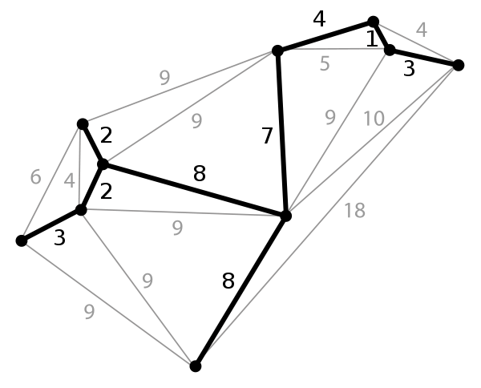

# IB CAS Project - created by David Xiong and Helen Bai, with help from IB CS HL. ALL RIGHTS RESERVES 🤪
### This repository is created by David Xiong and Helen Bai to implement various of algorithm in IBDP Mathematics
### Encryption

### Compression

### Graph Theory

In mathematics, graph theory is the study of graphs, which are mathematical structures used to model pairwise relations between objects. A graph in this context is made up of vertices which are connected by edges. A graph can be directed or undirected, weighted or unweighted. 

#### 1.Minimum Spanning Tree

A minimum spanning tree (MST) is a subset of the edges if a connected, edge-weighted undirected graph that connects all the vertices together, without any cycles and with the minimum possible total edge weight. The graph below is a planar graph and its minimum spanning tree. Each edge is labeled with its weight so this is a weighted graph. 

##### a.Kruskal Algorithm

##### b.Prim's Algorithm

#### 2.Chinese Postman Theorem

