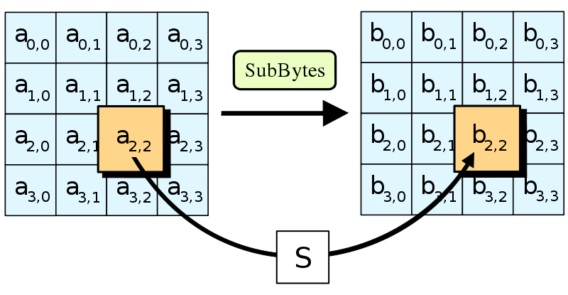
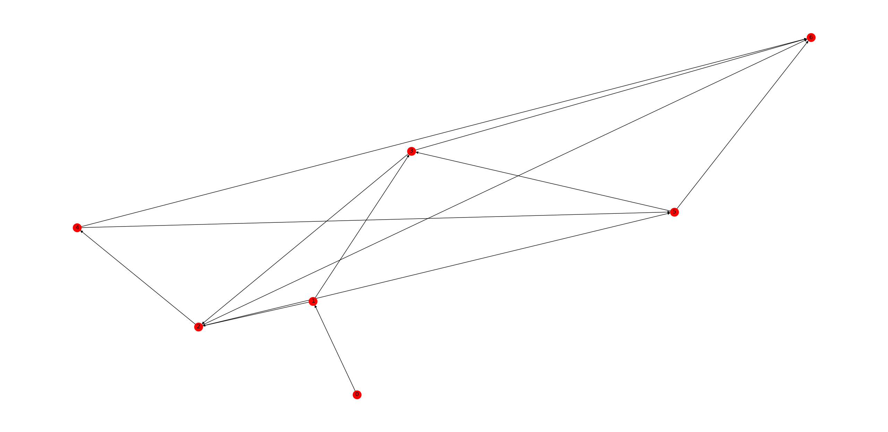
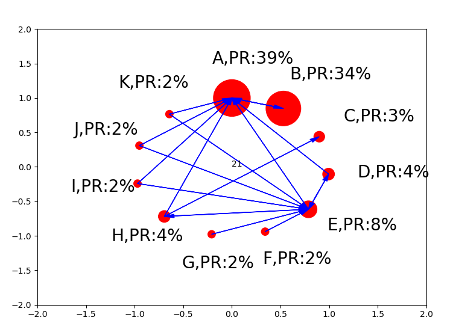
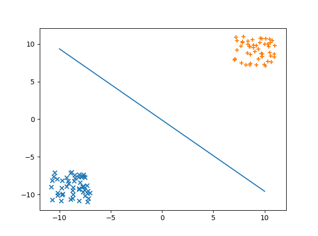

## CAS Project 
### Presented David Xiong and Helen Bai. 
### This IBDP CAS Prjecet with its IP are assets of Air Sealand Inc.
#### ALL RIGHTS RESERVES ©

### Encryption
Every data in the database requires encrypt, otherwise the security for information won't exist anymore. We all know that there are encryption algorithms, but how do them work? This python programming will illustrate it. To be specfic, this programming illustates how AES, a kind of asymmetirc encryption algorithms, works. Inside the algorithm, there is the utilization of further math works as Euler Theorem. 

[illustation_for_AES](codings/IllustrationForAES.py)



sample program is shown below
```ruby
import time as t
PrivateKey1=eval(input("Choose one:"))
PrivateKey2=eval(input("Choose another:"))
ClockNumber=eval(input("The size of the clock:"))
BaseNumber=eval(input("Base:"))

def getPPN(P1,P2,CN,BN):
    PPN1=((BN)**(P1))%CN
    PPN2=((BN)**(P2))%CN
    return PPN1,PPN2

def getShared(PPN,PK,CN):
    Remain=PPN%CN
    i=1
    while i < PK:
        Remain=(PPN*Remain)%CN
        i+=1
    return Remain
start=t.clock()
PPN1,PPN2=getPPN(PrivateKey1,PrivateKey2,ClockNumber,BaseNumber)
timeneed=t.clock()-start
print("PPN1,PPN2:",PPN1,PPN2)
print("timeneed:",round(timeneed,4))
print(getShared(PPN1,PrivateKey2,ClockNumber))
print(getShared(PPN2,PrivateKey1,ClockNumber))
```
### Compression

### Graph Theory

In mathematics, graph theory is the study of graphs, which are mathematical structures used to model pairwise relations between objects. A graph in this context is made up of vertices which are connected by edges. A graph can be directed or undirected, weighted or unweighted. 

#### 1.Minimum Spanning Tree

A minimum spanning tree (MST) is a subset of the edges if a connected, edge-weighted undirected graph that connects all the vertices together, without any cycles and with the minimum possible total edge weight. The graph below is a planar graph and its minimum spanning tree. Each edge is labeled with its weight so this is a weighted graph. 


##### a.Kruskal Algorithm

##### b.Prim's Algorithm

##### c.Dijstra Algorithm

Someone said Dijstra creates this algorithm using just 20 minutes. However, I learned how to code using greedy far more than 20 minutes. 
[result_of_programming](codings/Dijkstra_v1.py)


```ruby
import networkx as nx
import matplotlib.pyplot as plt

def Dijkstra(G, start, end):
    RG = G.reverse()
    dist = {}
    previous = {}
    for v in RG.nodes():
        dist[v] = float('inf')
        previous[v] = 'none'
    dist[end] = 0
    u = end
    while u != start:
        u = min(dist, key=dist.get)
        distu = dist[u]
        del dist[u]
        for u, v in RG.edges(u):
            if v in dist:
                alt = distu + RG[u][v]['weight']
                if alt < dist[v]:
                    dist[v] = alt
                    previous[v] = u
    path = (start,)
    last = start
    while last != end:
        nxt = previous[last]
        path += (nxt,)
        last = nxt
    return path
```

#### 2.Chinese Postman Theorem

### PageRank

Pagerank is really important when you want to search something in the searching engine. Imagine billions of results with the same key words jumping out at the same instant. Unrelated information will decrease the efficiency to even zero or negative. So here it is, pagerank. It involves in the thought of modeling and simulation. Plus, possiblities! There is even an animation of it! Have a look! [result_of_programming](codings/PageRank_test.py)


### Perceptron

Do you know what a neural network is? Well, basically, it's artificial intelligence. It's cool. So what is it made of? Perceptron! That's it, something used to solve binary variables questions. It has a variety of usages, from showing logic gates, to predict the breed of iris. [see_the_programming](codings/perception.py)


### Artificial Neural Network

[Artificial Neural Network analogy](pictures/neuron.png)

As we mention above, artificial neural network is actually a combination of mathematical models. 
[ANN Net](pictures/nueral_net.jpg)
